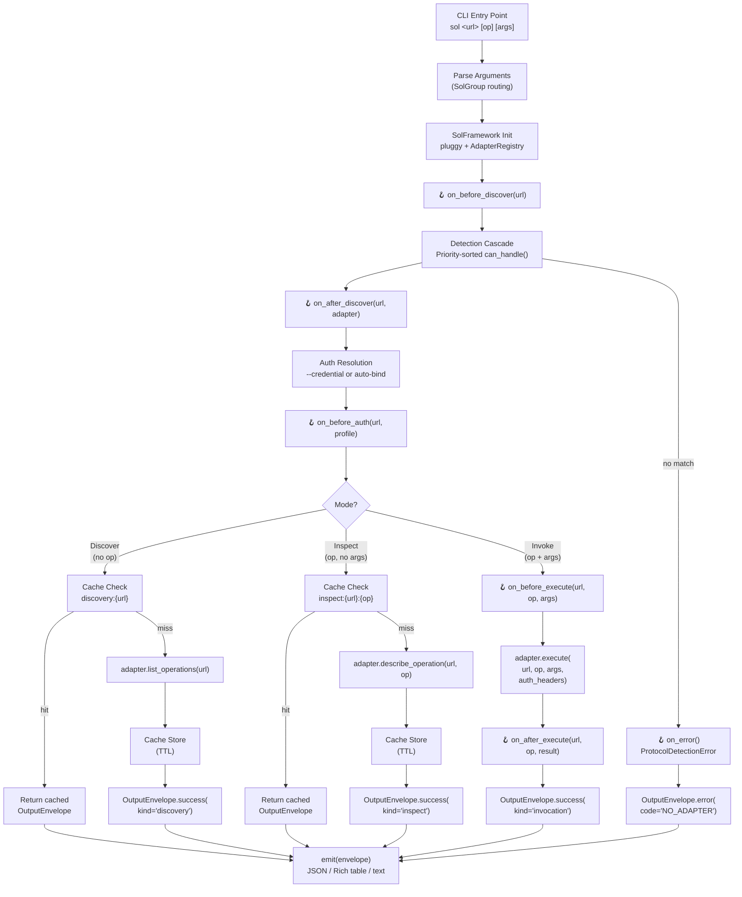

# Sol Architecture

## Overview

Sol is a Python rewrite of [uxc](https://github.com/holon-run/uxc) (54K LOC Rust CLI) with a plugin-based adapter architecture. It provides a single CLI interface to **discover**, **inspect**, and **invoke** API operations across any protocol — OpenAPI, GraphQL, gRPC, JSON-RPC, MCP — where each protocol is a separately installable satellite package.

**Core principle:** `sol` core ships with **zero adapters**. All protocol support is plugged in via `pip install sol-openapi`, `pip install sol-graphql`, etc. This keeps the core lean and allows independent versioning and release cycles for each protocol adapter.

### Key Design Goals

- **Uniform interface** — One CLI contract (`sol <url> -h`, `sol <url> <op> -h`, `sol <url> <op> args`) across all protocols.
- **Zero-config plugin discovery** — `pip install` a satellite package and it's immediately available. No registration files, no config edits.
- **Deterministic output** — Every command produces an `OutputEnvelope` with a stable JSON shape, safe for piping to `jq`, scripts, or agent workflows.
- **Extensible lifecycle** — pluggy-based hooks let plugins intercept any stage of the pipeline without modifying core code.

## Core Abstractions

### Adapter (`sol.adapter`)

The `Adapter` ABC is the central contract that every protocol plugin must implement. It defines six async methods:

| Method | Purpose |
|---|---|
| `protocol_name()` | Returns the protocol identifier (e.g. `"openapi"`, `"graphql"`) |
| `priority()` | Returns detection priority (higher = tried first in cascade) |
| `can_handle(url)` | Probes whether this adapter can handle a given URL |
| `list_operations(url)` | Returns all operations available at the URL (discovery) |
| `describe_operation(url, op_id)` | Returns detailed info about a specific operation (inspect) |
| `execute(url, op_id, args, auth_headers=)` | Invokes an operation with arguments and optional auth headers |

Supporting models:
- **`ExecutionResult`** — Pydantic model returned by `execute()`, containing `data`, `status_code`, and `headers`.
- **`AdapterMeta`** — Metadata model with `protocol_name` and `priority`, used for discovery ordering.

### AdapterRegistry (`sol.discovery`)

The `AdapterRegistry` is responsible for finding and managing adapter instances:

1. **Entry-point scanning** — Reads `importlib.metadata.entry_points(group="sol.adapters")` to find all installed adapter packages.
2. **Instantiation** — Loads each entry point, instantiates the class, and validates it's an `Adapter` subclass.
3. **Priority sorting** — Sorts adapters by descending priority for the detection cascade.
4. **Protocol detection** — Iterates sorted adapters calling `can_handle(url)` until one returns `True`.

### OutputEnvelope (`sol.envelope`)

Every Sol command produces an `OutputEnvelope` — a Pydantic model that guarantees a deterministic JSON shape:

```json
{
  "ok": true,
  "kind": "discovery",
  "protocol": "openapi",
  "endpoint": "https://api.example.com",
  "operation": null,
  "data": [...],
  "meta": {
    "cached": false,
    "duration_ms": null,
    "adapter": null
  }
}
```

Key fields:
- **`ok`** — Boolean success/failure flag.
- **`kind`** — One of `"discovery"`, `"inspect"`, or `"invocation"`.
- **`data`** — The payload (operation list, operation detail, or invocation result).
- **`error`** — Structured `ErrorInfo` with `code`, `message`, and `details` on failure.
- **`meta`** — `Metadata` with cache hit/miss info, duration, and adapter name.

Factory methods `OutputEnvelope.success(...)` and `OutputEnvelope.error(...)` ensure consistent construction.

### SchemaCache (`sol.cache`)

SQLite-backed schema cache using `aiosqlite` with TTL support:

- **Storage** — Schemas are stored as JSON blobs with `fetched_at` and `expires_at` timestamps.
- **TTL semantics** — Entries expire after a configurable TTL (default: 3600s). Expired entries can be served as stale with `stale_ok=True`.
- **Cache keys** — Format: `discovery:{url}` for operation lists, `inspect:{url}:{operation}` for details.
- **CLI integration** — `sol cache stats` shows entry counts; `sol cache clear` wipes the database.

Each `CacheEntry` exposes `cache_age_ms` and `cache_source` (either `"cache-hit"` or `"cache-stale"`) which are propagated into the envelope's `Metadata`.

### Auth (`sol.auth`)

The auth subsystem handles credential storage and injection:

- **Profiles** — Named credential configurations stored in `~/.config/sol/profiles.toml`. Each profile has a `name`, `auth_type` (bearer, api_key, basic, oauth2), and a `SecretSource` (literal value or environment variable).
- **Bindings** — Host-glob-to-profile mappings stored in `~/.config/sol/bindings.toml`. When no `--credential` flag is given, `AuthBindings.match(url)` auto-resolves the correct profile.
- **OAuth2** — Full authorization code flow with PKCE, device code flow, and automatic token refresh on expiry. Sessions are persisted to disk.
- **Injection** — `resolve_auth_headers(url)` returns a `dict[str, str]` of headers ready for the adapter's `execute()` call.

### SolFramework (`sol.__init__`)

The central runtime that wires everything together:

1. Creates a `pluggy.PluginManager` and registers `SolHookSpecs`.
2. Scans entry points and registers adapter plugins with pluggy.
3. Creates an `AdapterRegistry` backed by the plugin manager.
4. Exposes `hook` (the pluggy hook caller) and `registry` for the CLI to use.

### Configuration (`sol.config`)

`SolSettings` uses `pydantic-settings` with environment variable support:

| Setting | Env Var | Default | Description |
|---|---|---|---|
| `config_dir` | `SOL_CONFIG_DIR` | `~/.config/sol` | Base configuration directory |
| `cache_dir` | `SOL_CACHE_DIR` | `None` (uses config_dir) | Override cache database location |
| `cache_enabled` | `SOL_CACHE_ENABLED` | `True` | Enable/disable schema caching |
| `cache_ttl` | `SOL_CACHE_TTL` | `3600` | Cache TTL in seconds |
| `log_level` | `SOL_LOG_LEVEL` | `WARNING` | Logging level |

## Data Flow

### The Discover → Inspect → Invoke Pipeline

Sol routes every CLI invocation through a single pipeline. The mode is determined by which arguments are present:

```
sol <url> -h              → Discover mode  (no operation, -h flag)
sol <url> <op> -h         → Inspect mode   (operation present, -h flag)
sol <url> <op> key=value  → Invoke mode    (operation + arguments)
```



### Pipeline Detail

1. **CLI parsing** — `SolGroup` (a custom Click group) intercepts subcommand routing so that positional `<url>` and `<operation>` arguments don't collide with Typer subcommands like `auth` and `cache`.

2. **Framework init** — `SolFramework()` creates the pluggy `PluginManager`, registers hook specs, loads entry-point plugins, and builds the `AdapterRegistry`.

3. **Detection cascade** — `AdapterRegistry.detect_protocol(url)` fires `on_before_discover`, then tries each adapter by descending priority. The first `can_handle(url) → True` wins. Fires `on_after_discover` on match, or `on_error` if none match.

4. **Auth resolution** — `resolve_auth_headers(url, credential=...)` checks explicit `--credential` first, then auto-resolves via `AuthBindings.match(url)`. For OAuth2 profiles, loads the session from disk and auto-refreshes expired tokens. The `on_before_auth` hook allows plugins to override headers.

5. **Discover** — If no operation is given: check the cache for `discovery:{url}`, call `adapter.list_operations(url)` on miss, store the result, and wrap in `OutputEnvelope.success(kind="discovery")`.

6. **Inspect** — If operation is given but no args: check cache for `inspect:{url}:{op}`, call `adapter.describe_operation(url, op)` on miss, store, and wrap.

7. **Invoke** — If operation and args are present: fire `on_before_execute`, call `adapter.execute(url, op, args, auth_headers=...)`, fire `on_after_execute`, and wrap. Invocations are never cached.

8. **Output** — `emit(envelope, fmt=...)` routes to JSON (default), Rich tables (`-h` triggers `table` format), or plain text (`--format text`).

## Plugin System

### Architecture

Sol's plugin system is built on two complementary mechanisms:

1. **Python entry points** — For adapter discovery. Packages declare an entry point in the `sol.adapters` group, and Sol finds them automatically at runtime via `importlib.metadata`.

2. **pluggy hooks** — For lifecycle extensibility. Plugins can implement hook functions to intercept and modify behavior at any stage of the pipeline.

### How Adapter Discovery Works

When `SolFramework()` is initialized:

```
1. pluggy.PluginManager("sol") is created
2. SolHookSpecs are registered as the hook specification
3. importlib.metadata.entry_points(group="sol.adapters") is scanned
4. Each entry point is loaded and registered with pluggy
5. AdapterRegistry scans the same entry points to build adapter instances
```

A satellite package registers itself via `pyproject.toml`:

```toml
[project.entry-points.'sol.adapters']
openapi = "sol_openapi:OpenAPIAdapter"
```

After `pip install sol-openapi`, Sol will automatically:
- Find the `openapi` entry point in the `sol.adapters` group
- Load `sol_openapi.OpenAPIAdapter`
- Register it with pluggy (for hooks) and the adapter registry (for detection)

### Priority and Detection Cascade

Each adapter declares a priority (default: 100). During `detect_protocol(url)`:

1. Adapters are sorted by priority descending (higher priority = tried first).
2. Each adapter's `can_handle(url)` is called in order.
3. The first adapter returning `True` wins and is used for the rest of the pipeline.

This allows protocol-specific adapters (e.g. one that recognizes `grpc://` URLs) to take precedence over generic ones.

### Writing Plugins That Use Hooks

Beyond adapters, plugins can implement any of the lifecycle hooks without being an adapter at all. For example, a logging plugin:

```python
from sol.hooks import hookimpl

class RequestLogger:
    @hookimpl
    def on_before_execute(self, url, operation_id, args):
        print(f"Calling {operation_id} on {url}")

    @hookimpl
    def on_after_execute(self, url, operation_id, result):
        print(f"Got result from {operation_id}")
```

Register it programmatically:

```python
from sol import SolFramework

framework = SolFramework()
framework.register_plugin(RequestLogger())
```

Or via entry points for automatic loading.

## Hook Lifecycle

Sol defines six lifecycle hooks via pluggy. Each hook fires at a specific point in the pipeline and receives relevant context.

### Hook Specifications

| Hook | When It Fires | Parameters | Returns |
|---|---|---|---|
| `on_before_discover` | Before adapter detection begins | `url: str` | `None` |
| `on_after_discover` | After an adapter is selected | `url: str, adapter: Adapter` | `None` |
| `on_before_execute` | Before an operation is invoked | `url: str, operation_id: str, args: dict` | `None` |
| `on_after_execute` | After an operation completes | `url: str, operation_id: str, result: Any` | `None` |
| `on_before_auth` | Before auth headers are injected | `url: str, profile: Profile \| None` | `dict[str, str] \| None` |
| `on_error` | When any lifecycle error occurs | `error: Exception` | `None` |

### Hook Behavior

- **Notification hooks** (`on_before_discover`, `on_after_discover`, `on_before_execute`, `on_after_execute`, `on_error`) — All registered implementations are called. Return values are ignored.
- **First-result hook** (`on_before_auth`) — Uses `firstresult=True`. The first plugin that returns a non-`None` dict of headers wins, and those headers replace the default auth headers.

### Lifecycle Sequence

For a full invocation (`sol <url> <op> key=value`), the hooks fire in this order:

```
1. on_before_discover(url)           ← about to probe adapters
2.   adapter.can_handle(url)         ← detection cascade (not a hook)
3. on_after_discover(url, adapter)   ← adapter selected
4. on_before_auth(url, profile)      ← auth about to be injected
5. on_before_execute(url, op, args)  ← about to call adapter.execute()
6.   adapter.execute(...)            ← actual invocation (not a hook)
7. on_after_execute(url, op, result) ← invocation complete
```

If any phase raises an exception:

```
on_error(error)                      ← fires for any SolError
```

### Implementing a Hook

Use the `@hookimpl` decorator from `sol.hooks`:

```python
from sol.hooks import hookimpl

class MyPlugin:
    @hookimpl
    def on_before_discover(self, url: str) -> None:
        """Log every URL before detection runs."""
        print(f"[MyPlugin] Discovering: {url}")

    @hookimpl
    def on_error(self, error: Exception) -> None:
        """Send errors to a monitoring service."""
        send_to_sentry(error)
```

## Configuration

### Configuration Sources

Sol uses `pydantic-settings` which merges configuration from multiple sources (highest priority first):

1. **Environment variables** — Prefixed with `SOL_` (e.g. `SOL_CACHE_TTL=7200`)
2. **`.env` file** — Loaded from the current working directory
3. **Defaults** — Built-in defaults in `SolSettings`

### Directory Layout

```
~/.config/sol/
├── config.toml       # General settings (reserved for future use)
├── profiles.toml     # Auth credential profiles
├── bindings.toml     # URL-to-profile bindings
├── cache.db          # SQLite schema cache
└── oauth/            # OAuth2 session files
    └── {profile}.json
```

### CLI Flags

| Flag | Short | Description |
|---|---|---|
| `--format` | `-f` | Output format: `json` (default), `table`, or `text` |
| `--no-cache` | | Bypass the schema cache |
| `--credential` | `-c` | Use a specific auth profile by name |
| `--data` | `-d` | JSON body string, or `-` to read from stdin |
| `--verbose` | `-v` | Increase logging (repeat for debug: `-vv`) |
| `-h` | | Discover or inspect mode (triggers `table` format) |

## Comparison with uxc

Sol is a Python rewrite of uxc with a fundamentally different architecture:

| Aspect | uxc (Rust) | Sol (Python) |
|---|---|---|
| Language | Rust | Python 3.12+ |
| Binary size | ~15 MB single binary | Requires Python runtime |
| Protocol support | Built-in (OpenAPI, GraphQL, gRPC, etc.) | Zero built-in; all via satellite packages |
| Plugin mechanism | `inventory` crate + `libloading` (C ABI) | Python entry points + pluggy |
| Adapter discovery | Compile-time registration + dynamic `.so` loading | Runtime entry-point scanning |
| Lifecycle hooks | None (monolithic) | 6 pluggy hooks for full pipeline interception |
| Schema cache | SQLite via `rusqlite` | SQLite via `aiosqlite` |
| HTTP client | `reqwest` with connection pooling | `httpx` async with connection pooling |
| Auth system | Credentials + bindings + signers | Profiles + bindings + OAuth2 flows |
| Output format | JSON envelope | Same JSON envelope shape (compatible) |
| CLI framework | `clap` | `typer` (built on Click) |
| Async runtime | `tokio` | `asyncio` |
| Configuration | TOML files | `pydantic-settings` with env var support |

### Why Sol Exists

- **Ecosystem access** — Python has richer libraries for rapid protocol adapter development (e.g. `openapi-core`, `gql`, `grpclib`).
- **Plugin ergonomics** — Python entry points are a standard packaging mechanism; authors don't need a Rust toolchain or C ABI knowledge.
- **Rapid iteration** — Satellite packages can be developed, tested, and published independently without rebuilding the core.
- **Agent integration** — Python-native Sol integrates more naturally into Python-based agent frameworks and workflows.

### What's Preserved from uxc

- The `discover → inspect → invoke` CLI contract
- The `OutputEnvelope` JSON shape (compatible across both CLIs)
- The auth credential/binding model
- The SQLite schema cache approach
- The same user-facing `<url> -h` / `<url> <op> -h` / `<url> <op> args` workflow

## Error Handling

Sol uses a six-class error hierarchy rooted at `SolError`:

```
SolError
├── ProtocolDetectionError  — No adapter matched the URL
├── SchemaRetrievalError    — Failed to fetch/parse remote schema
├── OperationNotFoundError  — Requested operation doesn't exist
├── InvalidArgumentsError   — Args don't match parameter schema
├── ExecutionError          — Error during operation invocation
└── AuthError               — Authentication/authorization failure
```

Every `SolError` carries a `message` and optional `details` string. The CLI catches these and maps them to `OutputEnvelope.error()` with appropriate error codes (`NO_ADAPTER`, `DISCOVERY_FAILED`, `INSPECT_FAILED`, `EXECUTION_FAILED`, `AUTH_FAILED`).

The `on_error` hook fires for any `SolError`, allowing plugins to add logging, metrics, or alerting.
